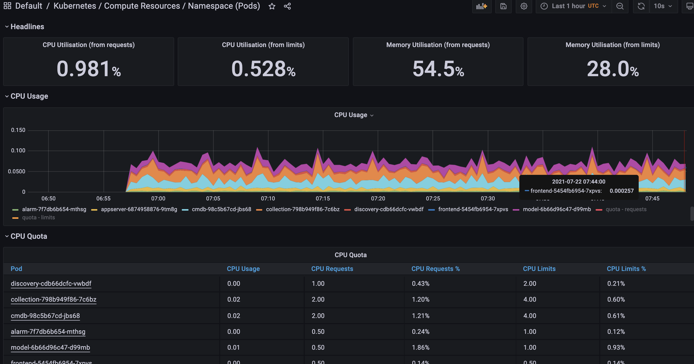

## Prometheus Operator 安装手顺

> author : 郁楠


前言:

对于 Kubernetes 来说，有没有更简单方式来监控报警?，有! 那就是 Prometheus Operator(https://prometheus-operator.dev/)

Prometheus Operator 为监控 Kubernetes 资源和 Prometheus 实例的管理提供了简单的定义，简化在 Kubernetes 上部署、管理和运行 Prometheus 和 Alertmanager 集群.

能监控什么?

- 动态的服务
- 动态 pods
- Ingress 和静态目标

## 安装步骤


1. 下载或者clone   https://github.com/moyu6027/kube-prometheus

2. 创建需要的命名空间和 CRDs 

   ```shell
   kubectl apply -f manifests/setup
   ```

3. 等待它们可用后再创建其余资源, 查看命令 

   ```shell
   $ kubectl get pods -n monitoring
   NAME                                   READY   STATUS    RESTARTS   AGE
   prometheus-operator-7649c7454f-wqtx7   2/2     Running   0          2m42s
   ```

   

4. 需要修改一处deployment YAML, 因为官方k8s的image源访问不了, 先拉一个docker image 

   ```shell
   docker pull ricardbejarano/kube-state-metrics:2.1.0
   ```

   

5. 然后进入kube-prometheus, 修改文件  

   ```shell
   cd manifests/
   vi kube-state-metrics-deployment.yaml
   将内容改为spec.template.spec.containers.image: ricardbejarano/kube-state-metrics:2.1.0
   ```

6. 然后整体开始部署CRD等资源 

   ```shell
   kubectl apply -f manifests/
   ```

7. 部署完后, 查看状态 

   ```shell
   kubectl get pods -n monitoring
   NAME                                   READY   STATUS             RESTARTS   AGE
   alertmanager-main-0                    2/2     Running            0          76m
   alertmanager-main-1                    2/2     Running            0          76m
   alertmanager-main-2                    2/2     Running            0          76m
   blackbox-exporter-7d7979f957-b5kjb     3/3     Running            0          76m
   grafana-5c87fcf499-p6b7r               1/1     Running            0          76m
   kube-state-metrics-55c478d69-wd24t     3/3     Running            0          44m
   node-exporter-pmpkj                    0/2     Running            0         76m
   node-exporter-r4tlg                    0/2     Running            0         76m
   prometheus-adapter-7bd88d67fd-dq6m9    1/1     Running            0          76m
   prometheus-adapter-7bd88d67fd-wkpv7    1/1     Running            0          76m
   prometheus-k8s-0                       2/2     Running            0          76m
   prometheus-k8s-1                       2/2     Running            0          76m
   prometheus-operator-7cb79c454c-c5jkl   2/2     Running            0          78m
   
   kubectl get svc -n monitoring
   NAME                    TYPE        CLUSTER-IP       EXTERNAL-IP   PORT(S)                      AGE
   alertmanager-main       NodePort    10.101.41.255    <none>        9093:31341/TCP               77m
   alertmanager-operated   ClusterIP   None             <none>        9093/TCP,9094/TCP,9094/UDP   77m
   blackbox-exporter       ClusterIP   10.98.242.59     <none>        9115/TCP,19115/TCP           77m
   grafana                 NodePort    10.111.214.154   <none>        3000:31355/TCP               77m
   kube-state-metrics      ClusterIP   None             <none>        8443/TCP,9443/TCP            77m
   node-exporter           ClusterIP   None             <none>        9100/TCP                     77m
   prometheus-adapter      ClusterIP   10.101.118.192   <none>        443/TCP                      77m
   prometheus-k8s          NodePort    10.110.105.5     <none>        9090:30231/TCP               77m
   prometheus-operated     ClusterIP   None             <none>        9090/TCP                     77m
   prometheus-operator     ClusterIP   None             <none>        8443/TCP                     80m
   ```

8. 其中grafana、alertmanager 和 prometheus 都创建了一个类型为 ClusterIP 的 Service,这里为了简单，直接使用 NodePort 类型的服务即可，编辑 `grafana`、`alertmanager-main` 和 `prometheus-k8s` 这3个 Service，将服务类型更改为 NodePort  

   ```shell
   # 将 type: ClusterIP 更改为 type: NodePort
   $ kubectl edit svc grafana -n monitoring  
   $ kubectl edit svc alertmanager-main -n monitoring
   $ kubectl edit svc prometheus-k8s -n monitoring
   ```

9. 这里有个注意的点, 我们可以看到 Prometheus 是两个副本，我们这里通过 Service 去访问，按正常来说请求是会去轮询访问后端的两个 Prometheus 实例的，但实际上我们这里访问的时候始终是路由到后端的一个实例上去，因为这里的 Service 在创建的时候添加了 `sessionAffinity: ClientIP` 这样的属性，会根据 `ClientIP` 来做 session 亲和性，所以我们不用担心请求会到不同的副本上去. 

10. > 为什么会担心请求会到不同的副本上去呢？正常多副本应该是看成高可用的常用方案，理论上来说不同副本本地的数据是一致的，但是需要注意的是 Prometheus 的主动 Pull 拉取监控指标的方式，由于抓取时间不能完全一致，即使一致也不一定就能保证网络没什么问题，所以最终不同副本下存储的数据很大可能是不一样的，所以这里我们配置了 session 亲和性，可以保证我们在访问数据的时候始终是一致的。

11. 去Grafana看, 默认有一些模板, 也可导入13105,14623,9965,13402,14518,8919模板




如果要清理 Prometheus-Operator，可以直接删除对应的资源清单即可

```
$ kubectl delete -f manifests/ 
$ kubectl delete -f manifests/setup/
```


### 如何设置grafana的权限


kubectl create cm grafana-config --from-file=grafana.ini -n monitoring


vi manifests/grafana-deployment.yaml


### 如何集成missing-container-metrics


```
kubectl create namespace missing-container-metrics

helm install missing-container-metrics  missing-container-metrics -n missing-container-metrics

helm -n missing-container-metrics list
```

